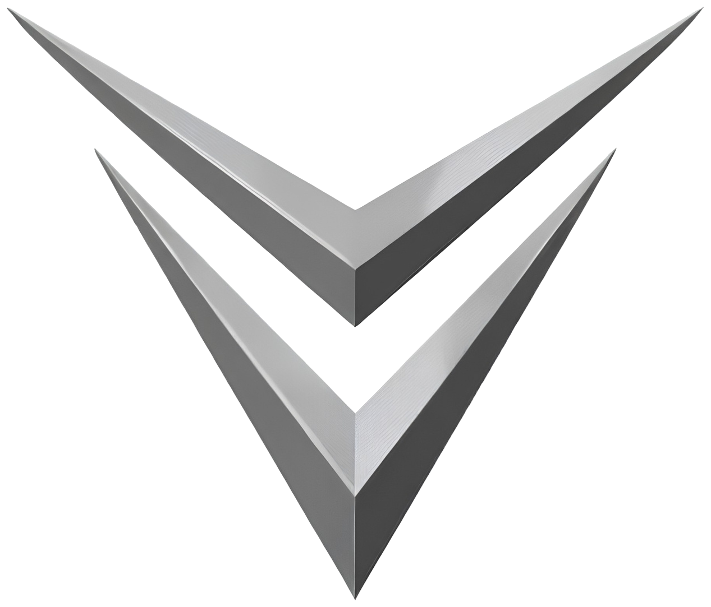
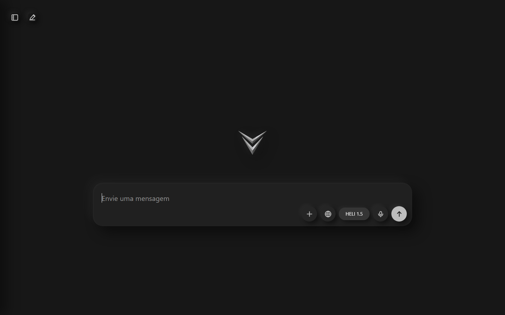

<p align="center">
  
</p>

<h1 align="center">CHEVEL AI</h1>

<p align="center">
  <strong>Local cognitive control layer for Dum-E/U, WIL-E, robotics workflows, and safe autonomous operation.</strong>
</p>

<p align="center">
  <a href="https://github.com/macksonvictor/chevel-ai/actions/workflows/ci.yml">
    
  </a>
  
  
  
  
</p>

<p align="center">
  <a href="#overview">Overview</a> |
  <a href="#dumeu--wil-e">Dum-E/U</a> |
  <a href="#product-gallery">Gallery</a> |
  <a href="#features">Features</a> |
  <a href="#cognitive-core">Cognitive Core</a> |
  <a href="#native-c-core">Native C++</a> |
  <a href="#api">API</a> |
  <a href="#architecture">Architecture</a> |
  <a href="#local-setup">Local setup</a> |
  <a href="#quality">Quality</a> |
  <a href="#roadmap">Roadmap</a>
</p>

---

## Overview

CHEVEL AI is a local assistant and robotics control brain built around Python orchestration, a deterministic C++ helper core, SQLite memory, a FastAPI chat interface, and a safe Dum-E/U bridge.

The project is designed to turn natural language, voice, and file context into structured decisions, plans, and safe actions for a future physical robotics platform. The current release is a local MVP: it can chat, remember, inspect cognitive state, classify risk, expose robotics control contracts, and block dangerous physical commands until human confirmation is available.

---

## Dum-E/U / WIL-E

The main product direction is integration with **Dum-E/U / WIL-E**: an advanced robotic system with a 7 DOF arm, gripper, mobile base, sensors, telemetry, and future vision/control stacks.

CHEVEL owns the high-level intelligence layer:

- interpret natural commands;
- decompose goals into safe steps;
- track world state and task memory;
- classify risk before actions;
- expose robotics APIs for dashboards and hardware adapters;
- keep emergency stop paths available and conservative.

The current Dum-E/U bridge runs in **safe simulation mode**. It defines the public control contract without claiming that real motors, ROS 2, cameras, SLAM, MoveIt, or Jetson adapters are already connected.

---

## Product Gallery

### Chat Interface

A minimal dark interface for local chat, file input, voice controls, web mode, and the public `HELI 1.5` model alias.

<p align="center">
  
</p>

---

## Features

### Local Chat

- FastAPI web app with HTTP and WebSocket support.
- Minimal dark interface inspired by modern AI chat tools.
- Text input, image/audio/text attachments, web search toggle, and voice controls.
- Public model display as `HELI 1.5`.

### Memory

- SQLite conversation memory.
- Knowledge, preferences, and event storage.
- Advanced procedural memory for task steps and learned routines.

### Safe Actions

- OS action routing for allowed local tasks.
- IoT, communication, and robotics controller boundaries.
- Risk classification before action execution.
- Human confirmation requirement for high-risk robotics commands.

### Dum-E/U Bridge

- Simulated robotics state for arm, joints, pose, gripper, base, battery, and safety.
- Emergency stop endpoint.
- Command endpoint with confirmation gate.
- Telemetry WebSocket for dashboards and future robot monitoring.

---

## Cognitive Core

CHEVEL includes a cognitive pipeline that coordinates the MVP modules around the existing LLM and controller layer:

- Decision Engine for risk-aware action selection.
- World Model for internal environment state.
- Advanced Memory for procedural task knowledge.
- Learning System for action-result episodes.
- Task Reasoning for decomposing complex commands.
- Fast Thinking for reflex-style safety rules.
- Self Monitoring for confidence and failure awareness.
- Goal System for persistent operational priorities.

The cognitive core is intentionally conservative. It can suggest and prepare robotics actions, but high-risk movement remains blocked until explicit confirmation is introduced.

---

## Native C++ Core

The native C++ layer is used for deterministic and fast local routines:

- intent detection;
- allowlisted program validation;
- action risk assessment;
- cosine similarity primitives;
- reflex evaluation for critical sensor states.

If the C++ executable or Python extension is unavailable, CHEVEL keeps running through Python fallbacks and reports native availability through `/health`.

---

## API

Core endpoints:

| Method | Endpoint | Purpose |
| --- | --- | --- |
| `GET` | `/health` | Runtime health, Ollama state, native core, cognitive state, Dum-E/U summary |
| `POST` | `/api/chat` | Main chat route with model, web mode, and attachments |
| `GET` | `/api/cognitive/health` | Cognitive health summary |
| `GET` | `/api/cognitive/state` | World model, goals, fast thinking, and learning state |

Dum-E/U endpoints:

| Method | Endpoint | Purpose |
| --- | --- | --- |
| `GET` | `/api/dume/status` | Current simulated robotics state |
| `GET` | `/api/dume/capabilities` | Supported command and telemetry contract |
| `POST` | `/api/dume/command` | Safe robotics command gateway |
| `POST` | `/api/dume/emergency-stop` | Emergency stop path |
| `WS` | `/ws/dume/telemetry` | Real-time telemetry stream |

Example Dum-E/U command:

```json
{
  "command": "home",
  "parameters": {},
  "confirm": false,
  "source": "api"
}
```

Without confirmation, motion commands return `requires_confirmation`. Emergency stop remains available.

---

## Architecture

```txt
chevel-ai/
|-- core/
|   |-- cognitive_core.py
|   |-- decision_engine.py
|   |-- fast_thinking.py
|   |-- goal_system.py
|   |-- intent_processor.py
|   |-- learning_system.py
|   |-- llm_engine.py
|   |-- memory_advanced.py
|   |-- memory_system.py
|   |-- self_monitor.py
|   |-- task_reasoning.py
|   `-- world_model.py
|-- controllers/
|   |-- dume_controller.py
|   |-- os_controller.py
|   |-- iot_controller.py
|   |-- comm_controller.py
|   `-- robot_controller.py
|-- interfaces/
|   `-- chat/
|       |-- server.py
|       `-- web/
|-- native/
|   |-- chevel_core.cpp
|   |-- chevel_native.cpp
|   `-- CMakeLists.txt
|-- scripts/
|-- docs/
|-- tests/
|-- utils/
`-- chevel_main.py
```

More detail:

- [Architecture](./docs/ARCHITECTURE.md)
- [Dum-E/U Bridge](./docs/DUME_BRIDGE.md)
- [Safety Model](./docs/SAFETY_MODEL.md)

---

## Local Setup

### Requirements

- Python 3.11 or newer.
- Ollama installed for local model execution.
- Optional C++ toolchain for the native helper core.

### 1. Enter the project

```powershell
cd C:\END0-SYM\chevel\chevel-ai
```

### 2. Install dependencies

```powershell
powershell -ExecutionPolicy Bypass -File .\scripts\setup_windows.ps1
```

### 3. Configure the model

```powershell
$env:CHEVEL_PUBLIC_MODEL="HELI 1.5"
$env:CHEVEL_MODEL="llama3.2:latest"
ollama serve
ollama pull llama3.2:latest
```

### 4. Start CLI

```powershell
.\.venv\Scripts\python.exe chevel_main.py --mode cli
```

### 5. Start chat

```powershell
.\.venv\Scripts\python.exe chevel_main.py --mode chat --host 127.0.0.1 --port 8000
```

Open:

```txt
http://127.0.0.1:8000
```

---

## Quality

Run the test suite:

```powershell
.\.venv\Scripts\python.exe -m pytest -q
```

Build the optional C++ service:

```powershell
powershell -ExecutionPolicy Bypass -File .\scripts\build_cpp_service.ps1
.\native\bin\chevel_core.exe version
```

CI validates Python tests and required repository governance files.

---

## Roadmap

### Robotics Integration

- Connect ROS 2 topics for joints, pose, camera, LIDAR, battery, and diagnostics.
- Add adapters for embedded hardware APIs, serial controllers, and Jetson services.
- Add hardware confirmation flows for motion commands.

### Perception

- Add RGB-D object detection and pose estimation adapters.
- Prepare world-model updates from real sensor data.
- Add camera and mapping contracts without bypassing safety.

### Voice and Models

- Replace browser speech dependencies with a local ASR/TTS pipeline.
- Introduce dedicated HELI models for language, voice, and multimodal analysis.
- Keep the `HELI 1.5` public model alias stable while backend providers evolve.

### Product

- Improve the robotics dashboard.
- Add telemetry visualization.
- Add confirmation UX for high-risk actions.
- Prepare release documentation for hardware integration phases.

---

## Support

Use GitHub Issues for public bugs and feature requests that do not include private data or hardware secrets.

For vulnerability reports, read [SECURITY.md](./SECURITY.md).

---

## License

This repository is licensed under the [MIT License](./LICENSE).
